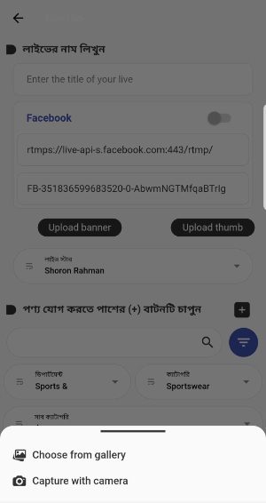
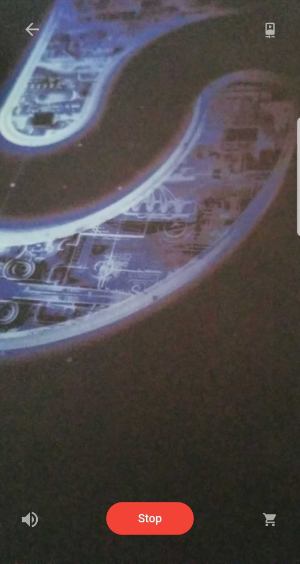

# liveroom

In this application I have used Flutter for mobile app development and Node.js (Nest js) as server side back-end api development.

## Some Screenshots of this application's journey are shared here except for the code part due to company policy. This application is still under continuous development phase. 

#### Live list page

#### Create new live page with social media stream attachment

#### Banner & Thumb choose options

#### Image upload permission page

#### Banner & Thumb uploaded page

#### Live products add page

#### New Live created page

#### Live Detail page

#### Confirm Live broadcast page

#### Live streaming page

